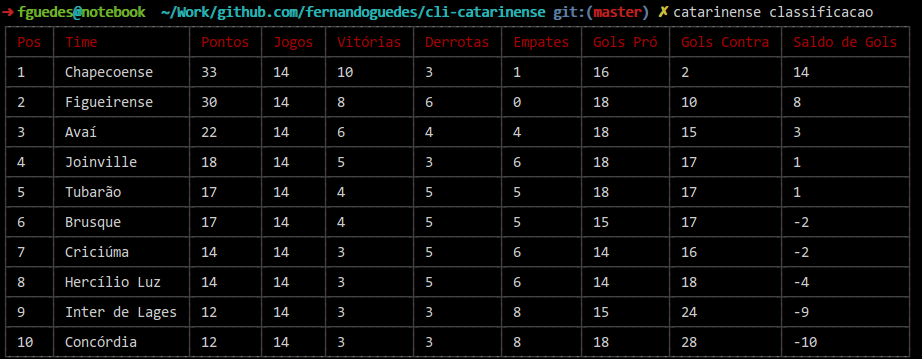

# :soccer: CLI Campeonato Catarinense

CLI com informações do Campeonato Catarinense

# Instalação

`npm install cli-catarinense`

# Uso

## Classificação

`catarinense classificacao` ou `catarinense c`

# Autor

Luís Fernando Guedes
